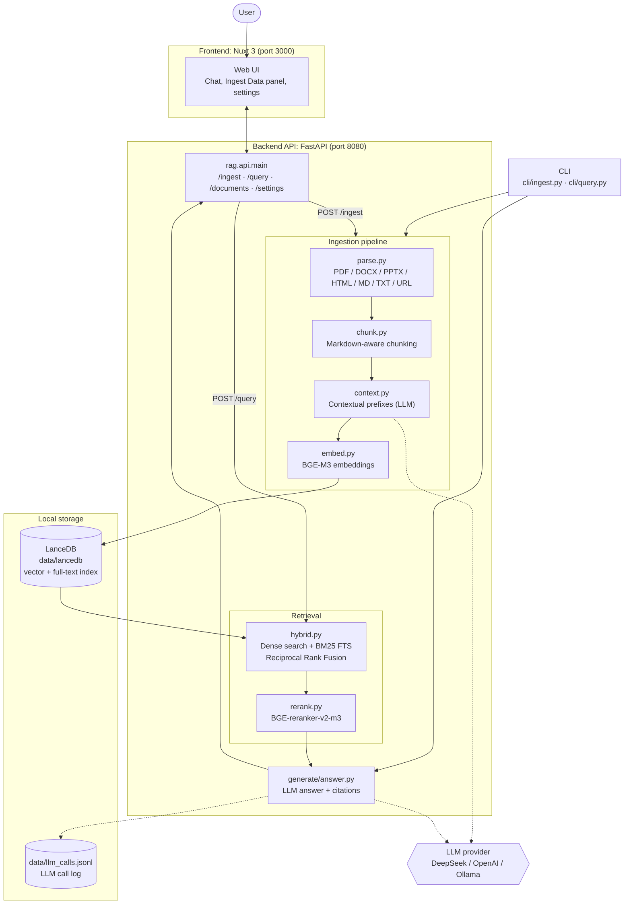

# Nongor


[](LICENSE)
[](https://riverborn.com)

**Nongor is a local-first RAG (retrieval-augmented generation) chat app that
answers questions about your own documents with citations, keeping
embeddings, search, reranking and storage on your machine.**

You upload PDFs, Word files, slides, HTML, Markdown, text files or web pages.
Nongor parses and chunks them, embeds them locally with BGE-M3, and stores
them in an embedded LanceDB database. When you ask a question it runs hybrid
search (dense vectors plus BM25 keyword search), reranks the results with a
local BGE cross-encoder, and asks an LLM to write an answer that cites the
chunks it used. The LLM can be any OpenAI-compatible endpoint: DeepSeek,
OpenAI, or a fully local model through Ollama.

> [!NOTE]
> **Built by [Riverborn Limited](https://riverborn.com)**, an AI solutions
> company from Dhaka, Bangladesh. We build agentic AI, generative AI and
> conversational AI (voice, chat and RAG). If you need help building a RAG
> system or an AI product on your own data,
> **[book a call](https://riverborn.com/#book)** or email
> **[hello@riverborn.com](mailto:hello@riverborn.com)**.

## Table of contents

- [Features](#features)
- [How it works](#how-it-works)
- [Tech stack](#tech-stack)
- [Quick start](#quick-start)
  - [Prerequisites](#prerequisites)
  - [Environment variables](#environment-variables)
  - [Option A: Docker Compose](#option-a-docker-compose)
  - [Option B: Run natively](#option-b-run-natively)
  - [Choosing an LLM provider](#choosing-an-llm-provider)
- [Usage](#usage)
  - [Ingesting documents](#ingesting-documents)
  - [Asking questions](#asking-questions)
  - [API endpoints](#api-endpoints)
- [Configuration](#configuration)
- [Evaluation and tests](#evaluation-and-tests)
- [Project layout](#project-layout)
- [Limitations and known issues](#limitations-and-known-issues)
- [About Riverborn](#about-riverborn)
- [License](#license)
- [Acknowledgements](#acknowledgements)

## Features

- **Many input types:** `.pdf`, `.docx`, `.pptx`, `.html`, `.md`, `.txt`
  files and web URLs. Office files and PDFs are converted to Markdown with
  Docling; URLs are fetched with trafilatura, with a headless Chromium
  (Playwright) fallback for pages that need JavaScript.
- **Markdown-aware chunking:** chunks follow headings, target about 400
  tokens with 50 tokens of overlap, and keep the heading path of each chunk.
- **Contextual prefixes:** optionally, an LLM writes a short sentence or two
  that places each chunk in the context of its whole document before
  embedding. You can turn this off per ingest for speed.
- **Local embeddings:** BGE-M3 (1024-dimensional, multilingual) via
  FlagEmbedding, on CUDA if available, otherwise CPU.
- **Hybrid retrieval:** dense vector search and BM25 full-text search in
  LanceDB (top 50 each), merged with Reciprocal Rank Fusion.
- **Local reranking:** BGE-reranker-v2-m3 cross-encoder picks the top 8
  chunks for the answer.
- **Cited answers:** the LLM cites the chunk IDs it used; citation IDs that
  do not match a retrieved chunk are reported back as invalid.
- **Streaming chat UI:** a Nuxt 3 web app with chat, document upload with
  progress, a document list with delete, and a settings switch.
- **Query routing:** greetings and general-knowledge questions (and any
  question when no documents are ingested yet) skip retrieval and go straight
  to the LLM.
- **Duplicate detection:** documents are hashed (SHA-256) and re-ingesting the
  same content is skipped.
- **Swappable LLM:** any OpenAI-compatible API, set entirely through
  environment variables. `LLM_PROVIDER=local` makes the backend refuse to
  start unless the LLM URL is a private or loopback address.
- **Optional cloud services:** from the settings panel you can switch
  embeddings to OpenAI `text-embedding-3-small` and reranking to an
  OpenAI-model-based reranker. The local BGE models are the default.
- **LLM call log:** every LLM call's model, token counts and latency are
  appended to `data/llm_calls.jsonl`.
- **CLI tools:** ingest, query and an LLM connectivity smoke test from the
  command line.
- **Evaluation harness:** Recall@5, Recall@10, MRR, citation validity and
  LLM-judged faithfulness over your own labelled question set, with
  regression flagging between runs.

## How it works



**Ingestion:** a document is parsed to Markdown, split into chunks, given
optional LLM-written context prefixes, embedded with BGE-M3, and written to
LanceDB. LanceDB holds both the vectors and a BM25 full-text index.

**Query:** the question is embedded and searched two ways (dense and BM25).
The results are merged with Reciprocal Rank Fusion, reranked with the BGE
cross-encoder, and the top chunks are sent to the LLM, which writes an
answer with citations. The web UI receives the answer as a server-sent event
stream.

With the default settings, the only network traffic during a query is the
call to your LLM provider. If you point the LLM at Ollama on your own
machine, nothing leaves it. Model weights are downloaded from Hugging Face on
first use.

## Tech stack

| Layer | Technology |
|---|---|
| Backend API | Python 3.11+, FastAPI, Uvicorn, Pydantic |
| Parsing | Docling, trafilatura, Playwright (Chromium) |
| Chunking | tiktoken |
| Embeddings | BGE-M3 via FlagEmbedding (PyTorch) |
| Reranking | BGE-reranker-v2-m3 via FlagEmbedding |
| Vector and full-text store | LanceDB (embedded, files on disk) |
| LLM client | `openai` Python SDK against any OpenAI-compatible endpoint |
| Logging | structlog |
| Frontend | Nuxt 3, Vue 3, Tailwind CSS |
| Packaging | Docker, Docker Compose, uv or pip, npm |

## Quick start

### Prerequisites

- **Docker route:** Docker with Docker Compose.
- **Native route:** Python 3.11+ with [uv](https://github.com/astral-sh/uv)
  (recommended) or pip, and Node.js 18+ with npm.
- An API key for an OpenAI-compatible LLM provider (DeepSeek or OpenAI), or
  [Ollama](https://ollama.com) running locally.
- Disk space and RAM for the BGE models. BGE-M3 alone is about 1.2 GB and is
  downloaded from Hugging Face the first time it is used, so the first ingest
  or query is slow. A CUDA GPU speeds things up but is not required.

### Environment variables

The backend reads these from `.env` (see [`.env.example`](.env.example) and
[`backend-py/.env.example`](backend-py/.env.example)).

| Variable | Required | Default in code | Description |
|---|---|---|---|
| `LLM_BASE_URL` | yes | `https://api.openai.com/v1` | OpenAI-compatible API base URL |
| `LLM_API_KEY` | yes (except Ollama) | empty | API key for the LLM provider |
| `LLM_MODEL` | yes | `gpt-4o` | Model used to write answers |
| `LLM_SMALL_MODEL` | no | `gpt-4o-mini` | Model used for contextual prefixes and query routing |
| `LOG_LEVEL` | no | `INFO` | Log level |
| `LLM_PROVIDER` | no | unset | Set to `local` to refuse any non-private `LLM_BASE_URL` |
| `OPENAI_API_KEY` | no | falls back to `LLM_API_KEY` | Only used if you switch embeddings or reranking to OpenAI in settings |
| `ALLOWED_ORIGINS` | no | `*` | Comma-separated CORS origins for the API |
| `PORT` | no | `8080` (from `config.yaml`) | Port the API listens on |
| `ENV` | no | `development` | `development` turns on auto-reload |

The frontend reads `NUXT_PUBLIC_API_URL` (or `BASE_URL` at build time) for
the backend URL. It defaults to `http://localhost:8080`.

### Option A: Docker Compose

```bash
git clone https://github.com/riverbornai/nongor.git
cd nongor
cp .env.example .env        # then edit .env and set your LLM settings
mkdir -p data               # mounted into the backend as /app/data
docker compose up --build -d
```

- Web UI: <http://localhost:3000>
- API docs (Swagger): <http://localhost:8080/docs>

On Docker Desktop, make sure the project folder (or the `data` folder) is
allowed under Settings > Resources > File Sharing.

### Option B: Run natively

**1. Backend**

```bash
cd backend-py
cp .env.example .env        # then edit .env and set your LLM settings

# with uv
uv sync
uv run python main.py

# or with pip
pip install -r requirements.txt
playwright install chromium  # only needed for JavaScript-heavy URLs
python main.py
```

The API runs on <http://localhost:8080> (docs at `/docs`).

**2. Frontend** (in a second terminal)

```bash
cd frontend
npm install
npm run dev
```

The web UI runs on <http://localhost:3000>.

To check the LLM connection on its own:

```bash
cd backend-py
python -m cli.smoke "hello"
```

### Choosing an LLM provider

Set these in `.env`. The code is the same for every provider.

**DeepSeek**

```env
LLM_BASE_URL=https://api.deepseek.com/v1
LLM_API_KEY=your-api-key-here
LLM_MODEL=deepseek-chat
LLM_SMALL_MODEL=deepseek-chat
```

**OpenAI**

```env
LLM_BASE_URL=https://api.openai.com/v1
LLM_API_KEY=your-api-key-here
LLM_MODEL=gpt-4o
LLM_SMALL_MODEL=gpt-4o-mini
```

**Ollama (fully local, no key)**

Start Ollama first (for example `ollama run llama3`), then:

```env
LLM_PROVIDER=local
LLM_BASE_URL=http://localhost:11434/v1
LLM_API_KEY=ollama
LLM_MODEL=llama3
LLM_SMALL_MODEL=llama3
```

When the backend runs in Docker, `localhost` is the container itself. Use
`http://host.docker.internal:11434/v1` to reach Ollama on the host (Docker
Desktop), and note that `LLM_PROVIDER=local` only accepts `localhost`,
private IP ranges and `.local` hostnames.

## Usage

### Ingesting documents

Use the **Ingest Data** panel in the web UI, or the CLI:

```bash
cd backend-py
python -m cli.ingest /path/to/document.pdf
python -m cli.ingest https://example.com/article
python -m cli.ingest /path/to/document.pdf --no-context   # skip contextual prefixes (faster)
```

Or the API:

```bash
# a local path (on the backend machine) or a URL
curl -X POST http://localhost:8080/ingest \
  -H "Content-Type: application/json" \
  -d '{"source": "/path/to/document.pdf"}'

# a file upload; returns a task_id to poll at /ingest/status/{task_id}
curl -X POST http://localhost:8080/ingest/upload \
  -F "file=@/path/to/document.pdf"
```

### Asking questions

Use the chat in the web UI, or:

```bash
cd backend-py
python -m cli.query "What does the contract say about termination?"
```

```bash
curl -X POST http://localhost:8080/query \
  -H "Content-Type: application/json" \
  -d '{"query": "What does the contract say about termination?", "top_k": 8}'
```

The response contains the answer, the citations, the retrieved chunks, any
invalid citation IDs, and timings for each stage.

### API endpoints

| Method | Path | Purpose |
|---|---|---|
| `POST` | `/ingest` | Ingest a local path or URL |
| `POST` | `/ingest/upload` | Upload a file (multipart), processed in the background |
| `GET` | `/ingest/status/{task_id}` | Progress of an upload |
| `POST` | `/query` | Answer a question with citations |
| `POST` | `/query/stream` | Same, streamed as server-sent events |
| `GET` | `/documents` | List ingested documents |
| `DELETE` | `/documents/{doc_id}` | Remove a document and its chunks |
| `GET` / `POST` | `/settings` | Read or switch the embedding and reranker service |
| `GET` | `/healthz` | Health check and model load status |

## Configuration

Pipeline settings live in [`backend-py/config.yaml`](backend-py/config.yaml):

| Section | Settings |
|---|---|
| `chunk` | `target_tokens` (400), `overlap_tokens` (50), `min_tokens` (100) |
| `contextual_prefix` | `enabled`, `max_doc_tokens` (60000), `prefix_max_tokens` (100) |
| `embedding` | `model` (`BAAI/bge-m3`), `batch_size`, `device` (`auto`, `cuda`, `mps`, `cpu`) |
| `retrieval` | `dense_top_k` (50), `sparse_top_k` (50), `rrf_k` (60), `rerank_top_k` (8) |
| `rerank` | `model` (`BAAI/bge-reranker-v2-m3`), `batch_size` |
| `llm` | `temperature` (0.1), `max_output_tokens` (1500), `request_timeout_s` (60) |
| `store` | LanceDB `path` and table names |
| `api` | `host`, `port` (8080) |

LLM provider, model names and keys come only from environment variables.

All data is stored under `backend-py/data/` when running natively, or the
`data/` folder at the project root when using Docker Compose:

- `data/lancedb/`: the LanceDB tables (chunks with vectors and full-text
  index, and a documents table)
- `data/llm_calls.jsonl`: one line per LLM call with model, token counts and
  latency

## Evaluation and tests

The evaluation harness in [`backend-py/eval/`](backend-py/eval) measures
Recall@5, Recall@10, MRR, citation validity and faithfulness (judged by the
LLM), with bootstrap confidence intervals. It flags any metric that drops by
3% or more compared with the previous run.

1. Ingest your documents.
2. Replace the placeholder line in `backend-py/eval/dataset.jsonl` with your
   own labelled questions (`query`, `expected_chunk_ids`, `expected_answer`,
   `must_contain`, `must_not_contain`).
3. Run it:

```bash
cd backend-py
python -m eval.run
```

Results are written to `backend-py/eval/results/<timestamp>.json`. The
repository does not include a labelled dataset or published results, so it
makes no accuracy claims of its own.

Unit tests (chunking, RRF merge, reranking, answer building, API):

```bash
cd backend-py
uv sync --extra dev
uv run pytest
```

## Project layout

```
backend-py/                 Python backend
  main.py                   starts the FastAPI app with Uvicorn
  config.yaml               chunking, retrieval, model and storage settings
  src/rag/api/              FastAPI routes and request/response schemas
  src/rag/ingest/           parsing, chunking, contextual prefixes, embeddings, pipeline
  src/rag/retrieve/         hybrid search (RRF) and reranking
  src/rag/generate/         prompts and cited answer generation (plain and streaming)
  src/rag/store/            LanceDB tables, search and indexes
  src/rag/llm.py            the single OpenAI-compatible LLM client
  cli/                      ingest, query and smoke-test commands
  eval/                     evaluation harness and dataset template
  tests/                    pytest suite
  Dockerfile, docker-compose.yml   backend-only container
frontend/                   Nuxt 3 web UI (single app.vue, Tailwind)
docker-compose.yml          runs backend and frontend together
.env.example                environment template for Docker Compose
```

## Limitations and known issues

- **Not production hardened.** There is no authentication, no multi-user
  support and no rate limiting. CORS allows all origins by default. Run it on
  a trusted machine or network.
- **Model download and resources.** The BGE models are large and are
  downloaded on first use. On CPU, embedding big documents and reranking are
  slow. Apple Silicon (MPS) is not auto-selected because of hangs seen with
  FlagEmbedding; it is used only if you set `device: mps`.
- **Ingest progress is in memory.** Upload task status is lost when the
  backend restarts.
- **Switching embedding service needs re-ingesting.** BGE-M3 and OpenAI
  embeddings live in different vector spaces. Documents embedded with one
  service do not search well with the other.
- **The OpenAI embedding and reranker options always call
  `api.openai.com`.** They ignore `LLM_BASE_URL` and send your document text
  to OpenAI.
- **Query routing uses the LLM.** A question may occasionally be sent down the
  general-knowledge path instead of retrieval, and then has no citations.
- **Vector index above 10,000 chunks** switches to an approximate IVF_PQ
  index; below that LanceDB uses an exact scan. Large corpora have not been
  tested here.
- **No published accuracy numbers.** The evaluation harness is included, but
  you need to bring your own labelled questions.

## About Riverborn

Nongor was built by **[Riverborn Limited](https://riverborn.com)**, an AI
solutions company based in Dhaka, Bangladesh that builds AI systems for
clients worldwide. We build RAG systems for teams that need answers from
their own documents without sending those documents to a third party, and
Nongor is the local-first base we use for that work.

What we build:

- 🤖 **Agentic AI:** autonomous AI agents and multi-agent systems that
  automate real business workflows
- ✨ **Generative AI:** AI products and MVPs built on large language
  models, taken from prototype to production
- 💬 **Conversational AI:** voice AI agents, chatbots, and RAG systems that
  answer from your own documents and data

Need help with AI? We'd like to hear from you.

- 🌐 Website: [riverborn.com](https://riverborn.com)
- 📅 Book a discovery call: [riverborn.com/#book](https://riverborn.com/#book)
- ✉️ Email: [hello@riverborn.com](mailto:hello@riverborn.com)
- 💼 [LinkedIn](https://www.linkedin.com/company/74964253) · [X](https://x.com/riverbornai) · [Facebook](https://facebook.com/riverbornai) · [GitHub](https://github.com/riverbornai)

## License

Nongor is released under the
[PolyForm Internal Use License 1.0.0](LICENSE).

- You may use, run and modify it for free for your own or your company's
  internal purposes.
- You may not sell it, redistribute it, or offer it to others as a product or
  hosted service.
- For a commercial license, email
  [hello@riverborn.com](mailto:hello@riverborn.com).

See [LICENSE](LICENSE) for the full terms.

## Acknowledgements

Nongor builds on open-source work, including
[BGE-M3 and BGE-reranker-v2-m3](https://github.com/FlagOpen/FlagEmbedding)
from BAAI, [LanceDB](https://lancedb.com),
[Docling](https://github.com/docling-project/docling),
[trafilatura](https://github.com/adbar/trafilatura),
[FastAPI](https://fastapi.tiangolo.com) and [Nuxt](https://nuxt.com).
