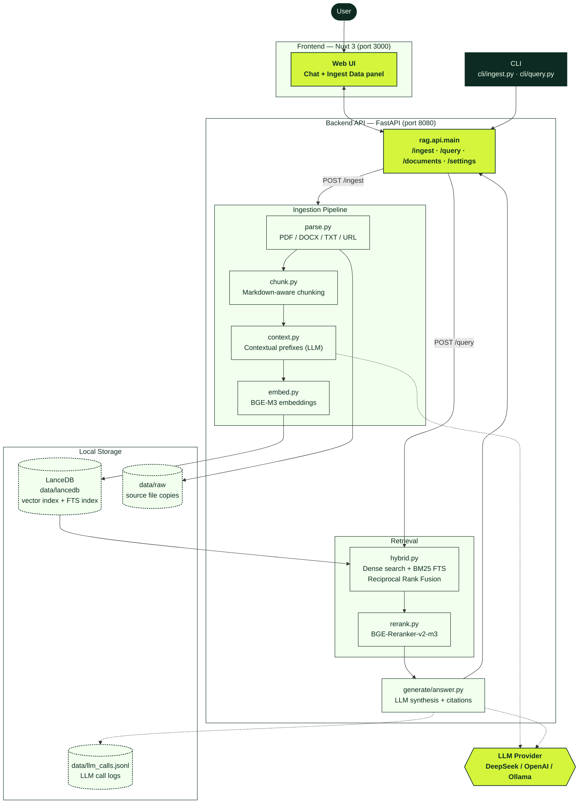

# Riverborn Nongor — High Accuracy Local First RAG Chat

A local-first, high-accuracy Retrieval-Augmented Generation (RAG) system built with **Python**, **LanceDB**, and **Nuxt 3**. 

This system indexes documents locally on your device using **BGE-M3** embeddings, performs hybrid search (dense + BM25 FTS) reranked with **BGE-Reranker-v2-m3**, and retrieves contextual answers with citations using local or API-based LLMs.

---

## 🏗️ Architecture



**Ingestion flow:** documents are parsed, chunked, given LLM-generated contextual prefixes, embedded with BGE-M3, and written to LanceDB (both vector and BM25 full-text indexes) alongside a raw file copy.

**Query flow:** a question triggers hybrid retrieval (dense vector search + BM25, merged via Reciprocal Rank Fusion) against LanceDB, the top candidates are reranked with BGE-Reranker-v2-m3, and the final context is passed to the configured LLM to synthesize a cited answer, streamed back to the Nuxt UI.

---

## 🚀 Setup & Local Execution

You can run the entire system locally using Docker Compose or by starting the backend and frontend services side-by-side natively.

### Option A: Docker Compose (Quickest)

1. Make sure you have Docker and Docker Compose installed.
2. Copy the `.env.example` file in `backend-py/` to a root `.env` file:
   ```bash
   cp backend-py/.env.example .env
   ```
3. Open the `.env` file and configure your API keys (see [🔑 Adding your LLM API Key](#-adding-your-llm-api-key) below).
4. Run the containers:
   ```bash
   docker-compose up --build -d
   ```
5. Access the application:
   - **Frontend UI:** [http://localhost:3000](http://localhost:3000)
   - **Backend API Docs:** [http://localhost:8080/docs](http://localhost:8080/docs)

---

### Option B: Native Side-by-Side Execution

#### 1. Setup the Python API Backend
**Requirements:** Python 3.11+ and [uv](https://github.com/astral-sh/uv) (recommended) or `pip`.

1. Navigate to the backend directory:
   ```bash
   cd backend-py
   ```
2. Copy the environment config:
   ```bash
   cp .env.example .env
   ```
3. Open the newly created `backend-py/.env` file and add your API key (see [🔑 Adding your LLM API Key](#-adding-your-llm-api-key) below).
4. Install dependencies and run the server:
   ```bash
   # Using uv:
   uv sync
   python main.py
   
   # Or using standard pip:
   pip install -r requirements.txt
   python main.py
   ```
   *The backend runs on [http://localhost:8080](http://localhost:8080).*

#### 2. Setup the Nuxt 3 Frontend
**Requirements:** Node.js 18+ and `npm`.

1. Navigate to the frontend directory:
   ```bash
   cd frontend
   ```
2. Install dependencies:
   ```bash
   npm install
   ```
3. Run the Nuxt dev server:
   ```bash
   npm run dev
   ```
   *The frontend runs on [http://localhost:3000](http://localhost:3000) (or falls back to `3001` if port 3000 is occupied).*

---

## 🔑 Adding your LLM API Key

The RAG application requires access to a Large Language Model (LLM) to synthesize answers. You must specify your model provider and insert your API key in the `.env` file.

Open the `.env` file (the root `.env` for Docker, or `backend-py/.env` for native run) and configure one of the following:

### 1. DeepSeek (Default API)
Create an account on DeepSeek, get an API key, and configure:
```env
LLM_BASE_URL=https://api.deepseek.com/v1
LLM_API_KEY=sk_your_deepseek_api_key_here
LLM_MODEL=deepseek-chat
LLM_SMALL_MODEL=deepseek-chat
```

### 2. OpenAI
Create an account on OpenAI, get an API key, and configure:
```env
LLM_BASE_URL=https://api.openai.com/v1
LLM_API_KEY=sk-proj-your_openai_api_key_here
LLM_MODEL=gpt-4o
LLM_SMALL_MODEL=gpt-4o-mini
```

### 3. Ollama (100% Local, Offline & Keyless)
Ensure Ollama is running locally (e.g. `ollama run llama3`), then configure:
```env
LLM_PROVIDER=local
LLM_BASE_URL=http://localhost:11434/v1
LLM_API_KEY=ollama
LLM_MODEL=llama3
LLM_SMALL_MODEL=llama3
```

---

## 📥 Ingesting Documents

You can upload files directly through the **Ingest Data** panel in the Web UI, or use the Command Line Interface (CLI):

```bash
# Ingest local PDF/Docx/TXT files or URLs
cd backend-py
python -m cli.ingest /path/to/document.pdf
python -m cli.ingest https://example.com/article

# Skip generating contextual summaries for faster ingestion:
python -m cli.ingest /path/to/document.pdf --no-context
```

---

## 📊 Evaluation & Testing

Measure retrieval recall, answer faithfulness, and citation validity against your dataset.

1. Populate the hand-labeled eval dataset in `backend-py/eval/dataset.jsonl` (contains questions, expected sources, and target answers).
2. Run evaluation harness:
   ```bash
   cd backend-py
   python -m eval.run
   ```
3. Run test suite:
   ```bash
   cd backend-py
   pytest
   ```

---

## 📁 Local Data Layout
All data is stored directly on your disk in `backend-py/data` (or the mapped Docker volume):
- `data/raw/`: Store raw copy of source files.
- `data/lancedb/`: LanceDB database files storing vector indexes and FTS indexes.
- `data/llm_calls.jsonl`: Logs LLM requests, token counts, and costs.
